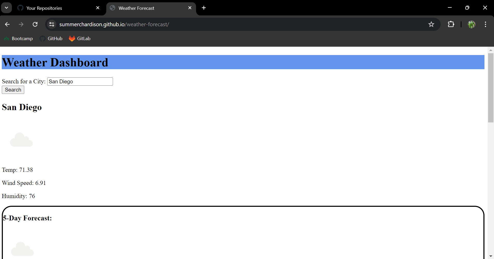

# weather-forecast

## Description

This web application is a weather forecast tracking app that'll give you information on the current day, as well as a forecast for the next 5 days. The main focus on what was used to make it was the open weather API, but it includes HTML, CSS, and JavaScript as well as the API. It was made to gain practice using APIs.

## To Application

[https://summerchardison.github.io/weather-forecast/](https://summerchardison.github.io/weather-forecast/)

## Credits

Summer Hardison

Thank you to the developers of the afformentioned API, and to my peers at UNCC. Without you my web development journey would be a lot more difficult.